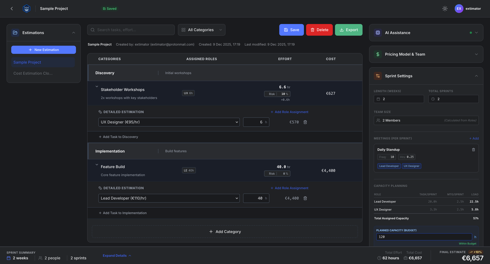
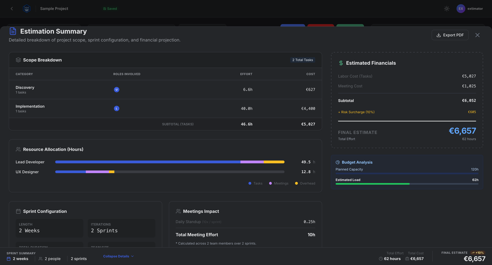

# Extimator User Documentation

Extimator is a one-page estimation workspace for freelancers, consultants, and small teams. It helps you turn a project scope into a structured estimate with roles, hours, sprint planning, and exports you can share with clients or stakeholders.

This documentation focuses on practical, day-to-day use.

---

## Preview

### Workspace overview

### Estimate summary

---

## Quick Start (5 minutes)

1. Sign in with your email (magic link).
2. Create a new estimation project.
3. Add categories and tasks.
4. Assign roles and hours so totals update automatically.
5. Review sprint planning and summary totals.
6. Save, then export (Excel or PDF).

---

## Table of Contents

1. [What is Extimator?](./01-what-is-extimator.md)
2. [Getting Started](./02-getting-started.md)
3. [Core Concepts](./03-core-concepts.md)
4. [Estimation Workflow](./04-estimation-workflow.md)
5. [Sprint Planning and Meetings](./05-sprint-planning.md)
6. [Pricing Models and Costs](./06-pricing-models.md)
7. [Exports (Excel, PDF)](./07-exports.md)
8. [Profile and Preferences](./08-profile-preferences.md)
9. [Early Access Notes](./09-early-access.md)
10. [Troubleshooting](./10-troubleshooting.md)
11. [Support and Feedback](./11-support-feedback.md)

---

## What Extimator is (and is not)

Extimator is designed for estimation and planning:
- Break work into categories and tasks
- Assign roles and hours
- Model sprint capacity and meeting load
- Export clean summaries

Extimator is not:
- A project management tool (tickets, sprints, boards)
- A time tracker
- A full invoicing or billing platform

---

## Recommended reading path

If you are new, start here:
- [What is Extimator?](./01-what-is-extimator.md)
- [Getting Started](./02-getting-started.md)
- [Core Concepts](./03-core-concepts.md)

If you want the practical workflow:
- [Estimation Workflow](./04-estimation-workflow.md)
- [Pricing Models and Costs](./06-pricing-models.md)
- [Exports](./07-exports.md)
